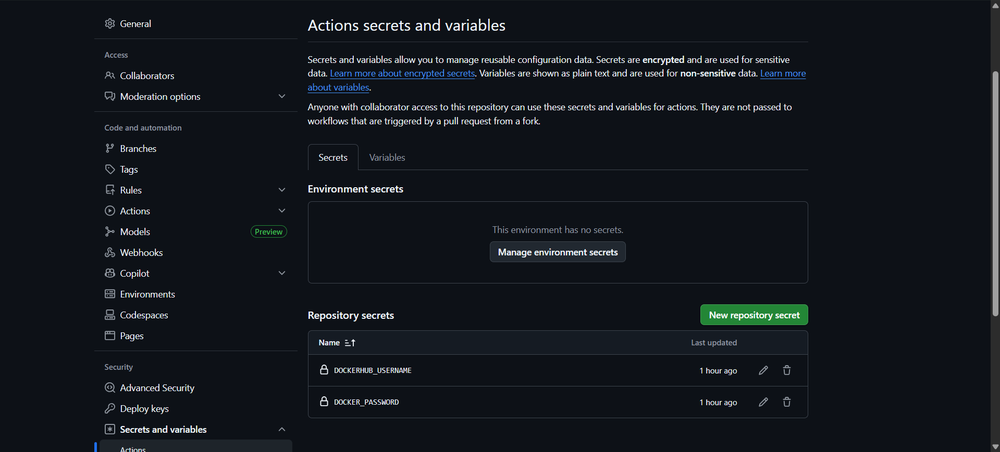
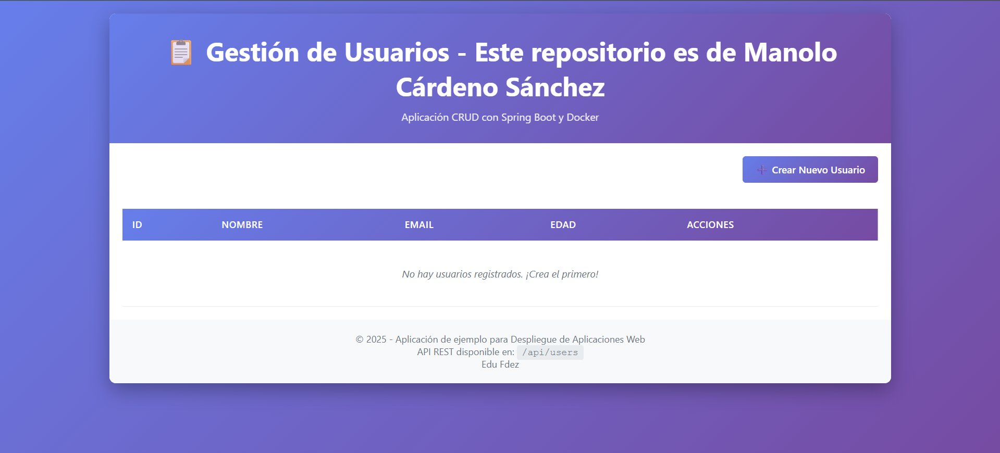
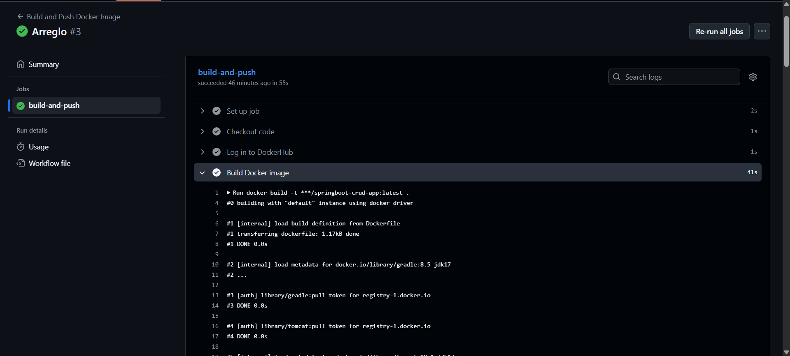
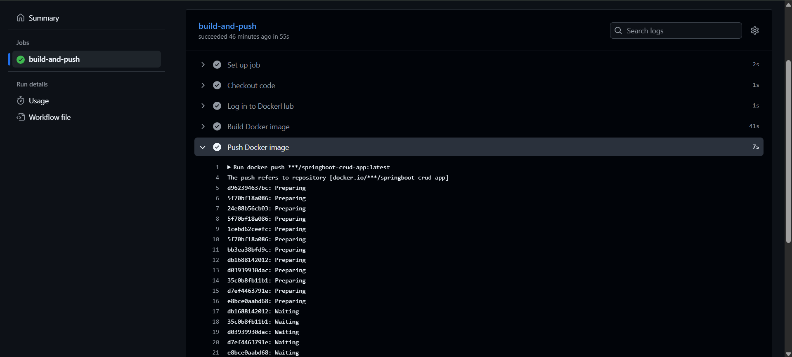

# Despliegue Automático con GitHub Actions

Para esta práctica hemos creado un workflow en GitHub Actions que automatiza la construcción de la imagen Docker y su publicación en Docker Hub cada vez que se hace push a la rama `master`.

## Tabla de Contenidos

- [Introducción](#introducción)
- [Archivo del Workflow](#archivo-del-workflow)
- [Configuración de Secretos en GitHub](#configuración-de-secretos-en-github)
- [Cómo Funciona el Workflow](#cómo-funciona-el-workflow)
- [Uso de la Imagen desde Docker Hub](#uso-de-la-imagen-desde-docker-hub)
- [Docker Compose Actualizado](#docker-compose-actualizado)

---

## Introducción

En este proyecto, utilizamos Github Actions para:

1. **Construir** la imagen Docker usando el `Dockerfile` existente
2. **Autenticarse** en Docker Hub con credenciales (usando secretos de Docker en el repositorio)
3. **Publicar** la imagen en Docker Hub automáticamente

### Ventajas de este enfoque

- **Automatización**: No necesitamos construir la imagen manualmente
- **Consistencia**: La imagen siempre se construye en el mismo entorno
- **Disponibilidad**: La imagen estará disponible en Docker Hub para cualquier servidor
- **Seguridad**: Las credenciales se gestionan como secretos cifrados

---

A continuación, se detallan paso por paso los cambios agregados en esta práctica:

## 1. Creación del archivo del Workflow

**Ubicación**: `.github/workflows/docker-publish.yml`

https://github.com/nolocardeno/2526_DAW_u2_springboot/blob/aa169b0a97b3b9e0836c5a36d611b259d167323d/.github/workflows/docker-publish.yml#L1-L26

### Explicación del archivo

| Sección | Descripción |
|---------|-------------|
| `name` | Nombre descriptivo del workflow |
| `on.push.branches` | Se ejecuta cuando hay un push a la rama `master` |
| `runs-on` | Usa una máquina virtual Ubuntu en los servidores de GitHub |
| `actions/checkout@v4` | Descarga el código del repositorio |
| `docker/login-action@v3` | Inicia sesión en Docker Hub con las credenciales |
| `docker build` | Construye la imagen usando el Dockerfile |
| `docker push` | Sube la imagen a Docker Hub |

Una vez que el workflow se ejecuta correctamente, la imagen está disponible públicamente en Docker Hub.

---

## 2. Configuración de Secretos en GitHub

Para que el workflow funcione, necesitamos configurar dos secretos en nuestro repositorio de GitHub:

| Nombre del Secreto | Valor |
|--------------------|-------|
| `DOCKERHUB_USERNAME` | Mi nombre de usuario de Docker Hub |
| `DOCKER_PASSWORD` | El token de acceso o contraseña |



---

## 3. Cambios en el Docker compose

El archivo `docker-compose.yml` ha sido actualizado para usar la imagen de Docker Hub en lugar de construirla localmente:

https://github.com/nolocardeno/2526_DAW_u2_springboot/blob/7dd3d2e675e35b1e557e0dd1064d587a8f70638d/docker-compose.yml#L1-L43

## 4. Cambios en la aplicación para mostrar mi nombre
En la aplicación ahora se mostrara mi nombre.



---

### 4. Enlace a la imagen en Docker Hub

Puedes ver la imagen publicada en:
```
https://hub.docker.com/r/nolorubio23/springboot-crud-app
```

---

## 5. Logs de Github Actions

Al hacer un push al repositorio, el workflow entra en acción y podemos ver los logs de cada acción especificada en el:
- Logs de creación de la imagen:

```
Run docker build -t ***/springboot-crud-app:latest .
#0 building with "default" instance using docker driver

#1 [internal] load build definition from Dockerfile
#1 transferring dockerfile: 1.17kB done
#1 DONE 0.0s

#2 [internal] load metadata for docker.io/library/gradle:8.5-jdk17
#2 ...

#3 [auth] library/gradle:pull token for registry-1.docker.io
#3 DONE 0.0s

#4 [auth] library/tomcat:pull token for registry-1.docker.io
#4 DONE 0.0s

#5 [internal] load metadata for docker.io/library/tomcat:10.1-jdk17
#5 DONE 0.8s

#2 [internal] load metadata for docker.io/library/gradle:8.5-jdk17
#2 DONE 0.8s

#6 [internal] load .dockerignore
#6 transferring context: 362B done
#6 DONE 0.0s

#7 [internal] load build context
#7 transferring context: 77.48kB done
#7 DONE 0.0s

#8 [builder 1/6] FROM docker.io/library/gradle:8.5-jdk17@sha256:7704366590930c03de7e514008ba3d7b7031b92591bd5a74fae79c16f3a17726
#8 resolve docker.io/library/gradle:8.5-jdk17@sha256:7704366590930c03de7e514008ba3d7b7031b92591bd5a74fae79c16f3a17726 done
#8 sha256:7704366590930c03de7e514008ba3d7b7031b92591bd5a74fae79c16f3a17726 1.21kB / 1.21kB done
#8 sha256:26611c45681a8966387aee7b2e1494405e20bc5a46dc5da0af9228c45f8e8ec4 0B / 17.46MB 0.1s
#8 sha256:f59836e46ad7a565813de06768ff2884700d12b7ceedacb1701a2983dc859010 2.21kB / 2.21kB done
#8 sha256:521f64de188a3ae1cdf32821464b44693cf9b19cbba5f652a72eb8898353eb88 10.44kB / 10.44kB done
#8 sha256:31bd5f451a847d651a0996256753a9b22a6ea8c65fefb010e77ea9c839fe2fac 0B / 30.45MB 0.1s
#8 sha256:0a1f4ac6e69541680073b21e32dd3de17885de514e36838468fe84707c7b5acf 0B / 144.90MB 0.1s
#8 sha256:31bd5f451a847d651a0996256753a9b22a6ea8c65fefb010e77ea9c839fe2fac 6.29MB / 30.45MB 0.3s
#8 sha256:31bd5f451a847d651a0996256753a9b22a6ea8c65fefb010e77ea9c839fe2fac 26.21MB / 30.45MB 0.5s
#8 sha256:0a1f4ac6e69541680073b21e32dd3de17885de514e36838468fe84707c7b5acf 12.58MB / 144.90MB 0.5s
#8 sha256:31bd5f451a847d651a0996256753a9b22a6ea8c65fefb010e77ea9c839fe2fac 30.45MB / 30.45MB 0.5s done
#8 sha256:0a1f4ac6e69541680073b21e32dd3de17885de514e36838468fe84707c7b5acf 20.97MB / 144.90MB 0.6s
#8 extracting sha256:31bd5f451a847d651a0996256753a9b22a6ea8c65fefb010e77ea9c839fe2fac 0.1s
#8 sha256:a36c85a96a6da44b1c1559a390715fd929fae60db504c8b9c745897d737ca485 0B / 173B 0.6s
#8 sha256:26611c45681a8966387aee7b2e1494405e20bc5a46dc5da0af9228c45f8e8ec4 1.05MB / 17.46MB 0.7s
#8 sha256:0a1f4ac6e69541680073b21e32dd3de17885de514e36838468fe84707c7b5acf 31.46MB / 144.90MB 0.7s
#8 sha256:26611c45681a8966387aee7b2e1494405e20bc5a46dc5da0af9228c45f8e8ec4 2.10MB / 17.46MB 0.8s
#8 sha256:0a1f4ac6e69541680073b21e32dd3de17885de514e36838468fe84707c7b5acf 39.85MB / 144.90MB 0.8s
#8 sha256:a36c85a96a6da44b1c1559a390715fd929fae60db504c8b9c745897d737ca485 173B / 173B 0.7s done
#8 sha256:30d3df2ee4d87245e77cfd06e96a597422956e0194064b0b71152e77d117ff54 0B / 733B 0.8s
#8 sha256:26611c45681a8966387aee7b2e1494405e20bc5a46dc5da0af9228c45f8e8ec4 3.15MB / 17.46MB 0.9s
#8 sha256:0a1f4ac6e69541680073b21e32dd3de17885de514e36838468fe84707c7b5acf 49.28MB / 144.90MB 0.9s
#8 sha256:26611c45681a8966387aee7b2e1494405e20bc5a46dc5da0af9228c45f8e8ec4 4.19MB / 17.46MB 1.1s
#8 sha256:0a1f4ac6e69541680073b21e32dd3de17885de514e36838468fe84707c7b5acf 72.35MB / 144.90MB 1.1s
#8 sha256:30d3df2ee4d87245e77cfd06e96a597422956e0194064b0b71152e77d117ff54 733B / 733B 0.9s done
#8 sha256:d07f8a99f32569a5ebfa8e9c3f4da0166c21ab862fab70f288cac5905e4d76f4 4.36kB / 4.36kB 1.1s
#8 sha256:26611c45681a8966387aee7b2e1494405e20bc5a46dc5da0af9228c45f8e8ec4 5.24MB / 17.46MB 1.2s
#8 sha256:0a1f4ac6e69541680073b21e32dd3de17885de514e36838468fe84707c7b5acf 87.03MB / 144.90MB 1.2s
#8 sha256:d07f8a99f32569a5ebfa8e9c3f4da0166c21ab862fab70f288cac5905e4d76f4 4.36kB / 4.36kB 1.1s done
#8 sha256:aad08408064ed46f64df063070cbdca2e9c201ef791fca8b24f281c176dd595c 0B / 51.55MB 1.2s
#8 sha256:26611c45681a8966387aee7b2e1494405e20bc5a46dc5da0af9228c45f8e8ec4 6.29MB / 17.46MB 1.3s
#8 sha256:0a1f4ac6e69541680073b21e32dd3de17885de514e36838468fe84707c7b5acf 97.52MB / 144.90MB 1.3s
#8 extracting sha256:31bd5f451a847d651a0996256753a9b22a6ea8c65fefb010e77ea9c839fe2fac 0.8s done
#8 sha256:26611c45681a8966387aee7b2e1494405e20bc5a46dc5da0af9228c45f8e8ec4 8.39MB / 17.46MB 1.5s
#8 sha256:0a1f4ac6e69541680073b21e32dd3de17885de514e36838468fe84707c7b5acf 116.39MB / 144.90MB 1.5s
#8 sha256:aad08408064ed46f64df063070cbdca2e9c201ef791fca8b24f281c176dd595c 22.02MB / 51.55MB 1.5s
#8 sha256:0a1f4ac6e69541680073b21e32dd3de17885de514e36838468fe84707c7b5acf 126.88MB / 144.90MB 1.6s
#8 sha256:aad08408064ed46f64df063070cbdca2e9c201ef791fca8b24f281c176dd595c 34.60MB / 51.55MB 1.6s
#8 sha256:26611c45681a8966387aee7b2e1494405e20bc5a46dc5da0af9228c45f8e8ec4 10.49MB / 17.46MB 1.8s
#8 sha256:0a1f4ac6e69541680073b21e32dd3de17885de514e36838468fe84707c7b5acf 144.90MB / 144.90MB 1.8s
#8 sha256:aad08408064ed46f64df063070cbdca2e9c201ef791fca8b24f281c176dd595c 51.55MB / 51.55MB 1.8s
#8 sha256:26611c45681a8966387aee7b2e1494405e20bc5a46dc5da0af9228c45f8e8ec4 13.63MB / 17.46MB 2.1s
#8 sha256:0a1f4ac6e69541680073b21e32dd3de17885de514e36838468fe84707c7b5acf 144.90MB / 144.90MB 1.9s done
#8 sha256:aad08408064ed46f64df063070cbdca2e9c201ef791fca8b24f281c176dd595c 51.55MB / 51.55MB 1.9s done
#8 sha256:f5b1cf504e03486f25a93789e25d170596a30a0bcddc7396219539ae4d3a3e3b 0B / 132.54MB 2.1s
#8 sha256:f43bfc2819ff808463a651fd1b0d4343062dcbc80dffcd07fb360ca66f98626b 170B / 170B 2.1s done
#8 sha256:26611c45681a8966387aee7b2e1494405e20bc5a46dc5da0af9228c45f8e8ec4 14.68MB / 17.46MB 2.2s
#8 sha256:f5b1cf504e03486f25a93789e25d170596a30a0bcddc7396219539ae4d3a3e3b 10.49MB / 132.54MB 2.2s
#8 sha256:26611c45681a8966387aee7b2e1494405e20bc5a46dc5da0af9228c45f8e8ec4 15.73MB / 17.46MB 2.4s
#8 sha256:f5b1cf504e03486f25a93789e25d170596a30a0bcddc7396219539ae4d3a3e3b 28.31MB / 132.54MB 2.4s
#8 sha256:26611c45681a8966387aee7b2e1494405e20bc5a46dc5da0af9228c45f8e8ec4 17.46MB / 17.46MB 2.5s done
#8 sha256:f5b1cf504e03486f25a93789e25d170596a30a0bcddc7396219539ae4d3a3e3b 36.70MB / 132.54MB 2.5s
#8 sha256:f5b1cf504e03486f25a93789e25d170596a30a0bcddc7396219539ae4d3a3e3b 45.09MB / 132.54MB 2.6s
#8 extracting sha256:26611c45681a8966387aee7b2e1494405e20bc5a46dc5da0af9228c45f8e8ec4 0.1s
#8 sha256:f5b1cf504e03486f25a93789e25d170596a30a0bcddc7396219539ae4d3a3e3b 56.62MB / 132.54MB 2.7s
#8 sha256:f5b1cf504e03486f25a93789e25d170596a30a0bcddc7396219539ae4d3a3e3b 66.61MB / 132.54MB 2.8s
#8 sha256:f5b1cf504e03486f25a93789e25d170596a30a0bcddc7396219539ae4d3a3e3b 75.50MB / 132.54MB 2.9s
#8 sha256:f5b1cf504e03486f25a93789e25d170596a30a0bcddc7396219539ae4d3a3e3b 92.27MB / 132.54MB 3.1s
#8 sha256:f5b1cf504e03486f25a93789e25d170596a30a0bcddc7396219539ae4d3a3e3b 99.61MB / 132.54MB 3.2s
#8 sha256:f5b1cf504e03486f25a93789e25d170596a30a0bcddc7396219539ae4d3a3e3b 111.15MB / 132.54MB 3.4s
#8 extracting sha256:26611c45681a8966387aee7b2e1494405e20bc5a46dc5da0af9228c45f8e8ec4 0.9s done
#8 sha256:f5b1cf504e03486f25a93789e25d170596a30a0bcddc7396219539ae4d3a3e3b 122.68MB / 132.54MB 3.7s
#8 sha256:f5b1cf504e03486f25a93789e25d170596a30a0bcddc7396219539ae4d3a3e3b 132.54MB / 132.54MB 3.8s
#8 sha256:f5b1cf504e03486f25a93789e25d170596a30a0bcddc7396219539ae4d3a3e3b 132.54MB / 132.54MB 4.8s done
#8 extracting sha256:0a1f4ac6e69541680073b21e32dd3de17885de514e36838468fe84707c7b5acf
#8 extracting sha256:0a1f4ac6e69541680073b21e32dd3de17885de514e36838468fe84707c7b5acf 1.3s done
#8 extracting sha256:a36c85a96a6da44b1c1559a390715fd929fae60db504c8b9c745897d737ca485 done
#8 extracting sha256:30d3df2ee4d87245e77cfd06e96a597422956e0194064b0b71152e77d117ff54 done
#8 extracting sha256:d07f8a99f32569a5ebfa8e9c3f4da0166c21ab862fab70f288cac5905e4d76f4 done
#8 extracting sha256:aad08408064ed46f64df063070cbdca2e9c201ef791fca8b24f281c176dd595c
#8 ...

#9 [stage-1 1/4] FROM docker.io/library/tomcat:10.1-jdk17@sha256:d2cd0027e6b828ad8a5ff7693a20d972f16af0139f7fcecafa0797b31809863e
#9 resolve docker.io/library/tomcat:10.1-jdk17@sha256:d2cd0027e6b828ad8a5ff7693a20d972f16af0139f7fcecafa0797b31809863e done
#9 sha256:d2cd0027e6b828ad8a5ff7693a20d972f16af0139f7fcecafa0797b31809863e 7.97kB / 7.97kB done
#9 sha256:5555010508e0938564d9a2fc6d7c0c3386c896743c142c207014f9b4d1a05a5b 2.72kB / 2.72kB done
#9 sha256:d7e557a209e888a501219479852f290c330a1621b70dfd293cda06f75601789b 13.03kB / 13.03kB done
#9 sha256:20043066d3d5c78b45520c5707319835ac7d1f3d7f0dded0138ea0897d6a3188 29.72MB / 29.72MB 2.6s done
#9 sha256:077c4ca28173a06771936e7d2dd6254602c0fa1edee45debed984b4b382915de 22.96MB / 22.96MB 3.0s done
#9 extracting sha256:20043066d3d5c78b45520c5707319835ac7d1f3d7f0dded0138ea0897d6a3188 1.0s done
#9 sha256:b88b6ae1b108522b13f2cdc7912b1e5784e2a63268ea6d6d967b4e562b803b6f 144.85MB / 144.85MB 5.2s done
#9 sha256:67cf99ea3a756f77f1989a181feed90c517d46369d9430b6d37e86797f650a47 159B / 159B 3.2s done
#9 sha256:02d80376fd82870628b01ae6f01bd27552bc9aa3a4cd5be88515f79fe298a87a 2.28kB / 2.28kB 3.3s done
#9 sha256:ba09cd1b52686ac9e9dbb220adb4ab688596c111fa8403f9fb633cbfbdee0eee 139B / 139B 3.5s done
#9 sha256:4f4fb700ef54461cfa02571ae0db9a0dc1e0cdb5577484a6d75e68dc38e8acc1 32B / 32B 4.2s done
#9 sha256:6431d88ca8c2ceaed69970f6c943b1b6f48e0a66b8750f8654bd2bf0c977be68 14.34MB / 14.34MB 5.2s done
#9 extracting sha256:077c4ca28173a06771936e7d2dd6254602c0fa1edee45debed984b4b382915de 0.9s done
#9 extracting sha256:b88b6ae1b108522b13f2cdc7912b1e5784e2a63268ea6d6d967b4e562b803b6f 1.4s done
#9 extracting sha256:67cf99ea3a756f77f1989a181feed90c517d46369d9430b6d37e86797f650a47 done
#9 extracting sha256:02d80376fd82870628b01ae6f01bd27552bc9aa3a4cd5be88515f79fe298a87a done
#9 extracting sha256:ba09cd1b52686ac9e9dbb220adb4ab688596c111fa8403f9fb633cbfbdee0eee done
#9 extracting sha256:4f4fb700ef54461cfa02571ae0db9a0dc1e0cdb5577484a6d75e68dc38e8acc1 done
#9 extracting sha256:6431d88ca8c2ceaed69970f6c943b1b6f48e0a66b8750f8654bd2bf0c977be68 0.2s done
#9 DONE 8.4s

#8 [builder 1/6] FROM docker.io/library/gradle:8.5-jdk17@sha256:7704366590930c03de7e514008ba3d7b7031b92591bd5a74fae79c16f3a17726
#8 ...

#10 [stage-1 2/4] RUN mkdir -p /app/data
#10 DONE 0.2s

#8 [builder 1/6] FROM docker.io/library/gradle:8.5-jdk17@sha256:7704366590930c03de7e514008ba3d7b7031b92591bd5a74fae79c16f3a17726
#8 ...

#11 [stage-1 3/4] RUN rm -rf /usr/local/tomcat/webapps/*
#11 DONE 0.1s

#8 [builder 1/6] FROM docker.io/library/gradle:8.5-jdk17@sha256:7704366590930c03de7e514008ba3d7b7031b92591bd5a74fae79c16f3a17726
#8 extracting sha256:aad08408064ed46f64df063070cbdca2e9c201ef791fca8b24f281c176dd595c 2.0s done
#8 extracting sha256:f5b1cf504e03486f25a93789e25d170596a30a0bcddc7396219539ae4d3a3e3b
#8 extracting sha256:f5b1cf504e03486f25a93789e25d170596a30a0bcddc7396219539ae4d3a3e3b 0.6s done
#8 extracting sha256:f43bfc2819ff808463a651fd1b0d4343062dcbc80dffcd07fb360ca66f98626b
#8 extracting sha256:f43bfc2819ff808463a651fd1b0d4343062dcbc80dffcd07fb360ca66f98626b done
#8 DONE 9.5s

#12 [builder 2/6] WORKDIR /app
#12 DONE 0.0s

#13 [builder 3/6] COPY build.gradle settings.gradle gradlew ./
#13 DONE 0.0s

#14 [builder 4/6] COPY gradle ./gradle
#14 DONE 0.0s

#15 [builder 5/6] COPY src ./src
#15 DONE 0.0s

#16 [builder 6/6] RUN chmod +x gradlew && ./gradlew bootWar --no-daemon
#16 0.159 Downloading https://services.gradle.org/distributions/gradle-8.14.3-bin.zip
#16 0.850 .............10%.............20%.............30%.............40%.............50%.............60%.............70%.............80%.............90%..............100%
#16 2.844 
#16 2.844 Welcome to Gradle 8.14.3!
#16 2.844 
#16 2.844 Here are the highlights of this release:
#16 2.845  - Java 24 support
#16 2.845  - GraalVM Native Image toolchain selection
#16 2.845  - Enhancements to test reporting
#16 2.845  - Build Authoring improvements
#16 2.845 
#16 2.845 For more details see https://docs.gradle.org/8.14.3/release-notes.html
#16 2.845 
#16 2.942 To honour the JVM settings for this build a single-use Daemon process will be forked. For more on this, please refer to https://docs.gradle.org/8.14.3/userguide/gradle_daemon.html#sec:disabling_the_daemon in the Gradle documentation.
#16 3.942 Daemon will be stopped at the end of the build 
#16 28.64 > Task :compileJava
#16 28.64 > Task :processResources
#16 28.64 > Task :classes
#16 28.74 > Task :resolveMainClassName
#16 29.44 > Task :bootWar
#16 29.50 
#16 29.50 BUILD SUCCESSFUL in 29s
#16 29.50 4 actionable tasks: 4 executed
#16 DONE 29.6s

#17 [stage-1 4/4] COPY --from=builder /app/build/libs/*.war /usr/local/tomcat/webapps/ROOT.war
#17 DONE 0.0s

#18 exporting to image
#18 exporting layers
#18 exporting layers 0.4s done
#18 writing image sha256:25182cfc754e27ece191a08d618c986b8dc5e9baed97fd537de606e66623897f done
#18 naming to docker.io/***/springboot-crud-app:latest done
#18 DONE 0.4s
```
- Logs de subida a Docker hub de la imagen:

```
Run docker push ***/springboot-crud-app:latest
The push refers to repository [docker.io/***/springboot-crud-app]
d962394637bc: Preparing
5f70bf18a086: Preparing
24e88b56cb03: Preparing
5f70bf18a086: Preparing
1cebd62ceefc: Preparing
5f70bf18a086: Preparing
bb3ea38bfd9c: Preparing
db1688142012: Preparing
d03939930dac: Preparing
35c0b8fb11b1: Preparing
d7ef4463791e: Preparing
e8bce0aabd68: Preparing
db1688142012: Waiting
35c0b8fb11b1: Waiting
d03939930dac: Waiting
d7ef4463791e: Waiting
e8bce0aabd68: Waiting
1cebd62ceefc: Mounted from library/tomcat
5f70bf18a086: Mounted from library/tomcat
bb3ea38bfd9c: Mounted from library/tomcat
d03939930dac: Mounted from library/tomcat
db1688142012: Mounted from library/tomcat
24e88b56cb03: Pushed
35c0b8fb11b1: Mounted from library/tomcat
d7ef4463791e: Mounted from library/tomcat
e8bce0aabd68: Mounted from library/tomcat
d962394637bc: Pushed
latest: digest: sha256:24a0308e732d1976a18b952df90b99db79fcd23e7033a66dce136dea2cd64116 size: 2826
```
## Resumen

| Componente | Descripción |
|------------|-------------|
| **Workflow** | `.github/workflows/docker-publish.yml` |
| **Trigger** | Push a la rama principal |
| **Imagen** | `nolorubio23/springboot-crud-app:latest` |
| **Secretos** | `DOCKERHUB_USERNAME`, `DOCKER_PASSWORD` |

### Flujo completo

1. Cambios en el código
2. Ejecución `git push` a rama principal
3. GitHub Actions construye y sube la imagen automáticamente
4. Cualquier servidor puede descargar la imagen con `docker pull`
5. Ejecutas `docker-compose up -d` para desplegar

---